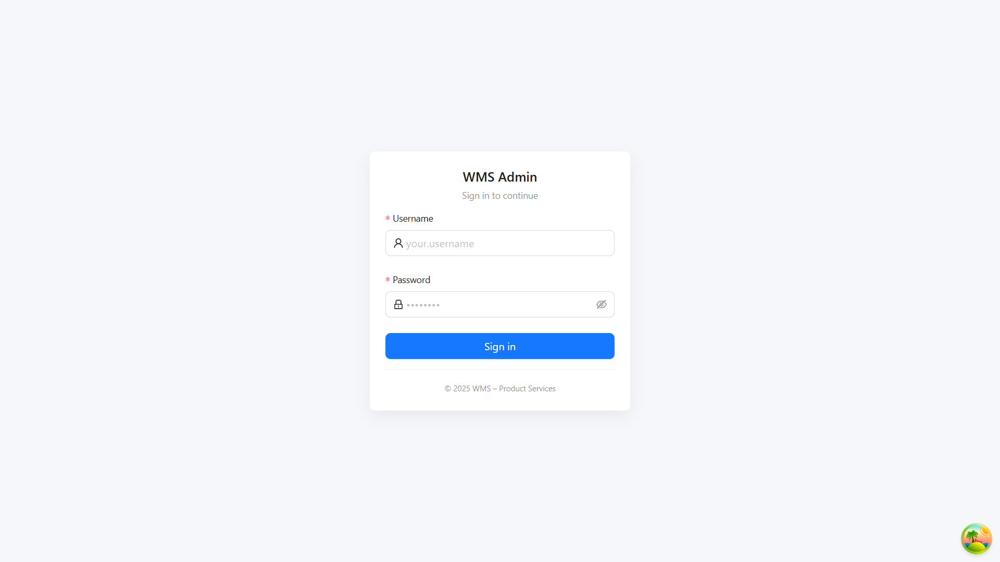
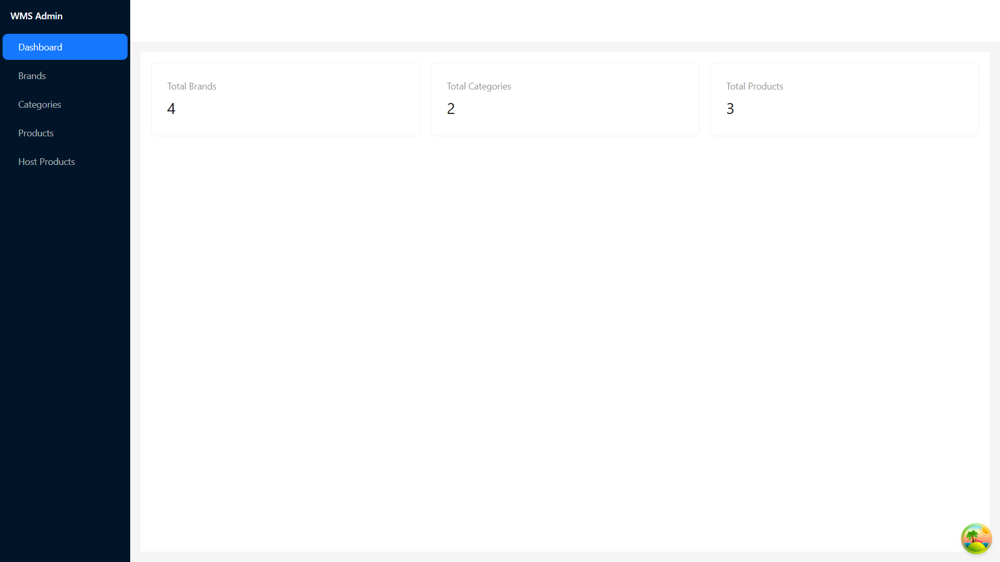
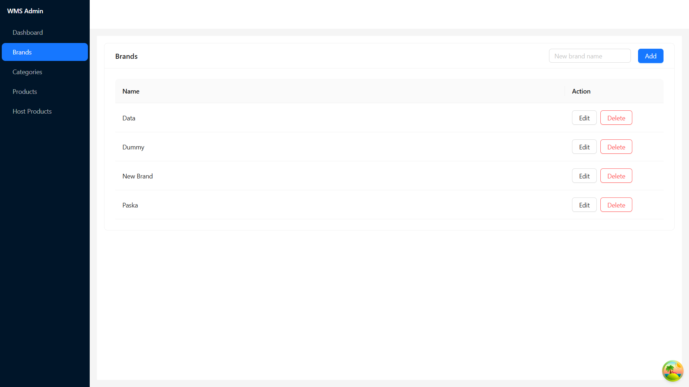
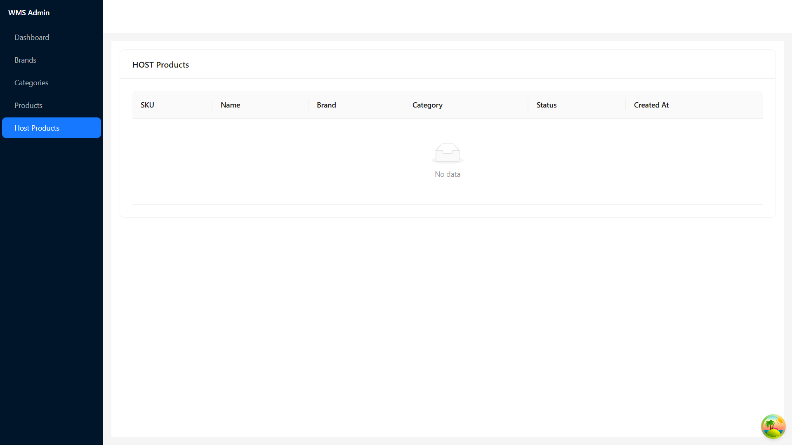

# WMS Frontend – Documentation

Frontend app for **WMS – product-services**. Built with **Vite + React + TypeScript**, **Ant Design** for UI, and **TanStack Query (React Query)** for data fetching/caching. This app talks to the .NET 8 backend you built.

---

## 1) Prerequisites

- **Node.js** ≥ 18 (LTS recommended)
- **npm** ≥ 9 or **pnpm** ≥ 8 or **yarn** ≥ 1.22  
  (Examples below use `npm`, feel free to switch to your package manager)
- Backend running (default: `http://localhost:5093`)

---

## 2) Key Technologies

- **Vite** (dev server & build tool)
- **React 18 + TypeScript**
- **Ant Design** (UI components)
- **TanStack Query** (server state / data fetching)
- **Axios** (HTTP client)
- **React Router v6** (routing)
- **ESLint & Prettier** (optional code consistency)

---

## 3) Project Structure

```
client/
├─ src/
│  ├─ api/
│  │  ├─ axios.ts          # axios config (baseURL, auth interceptor)
│  │  └─ endpoints.ts      # endpoint constants (EP)
│  ├─ hooks/
│  │  ├─ useAuth.ts        # login/logout, token storage
│  │  ├─ useBrands.ts      # brand CRUD
│  │  ├─ useCategories.ts  # category CRUD
│  │  └─ useProducts.ts    # product list / CRUD
│  ├─ pages/
│  │  ├─ Dashboard/
│  │  │  └─ DashboardPage.tsx
│  │  ├─ Brands/BrandList.tsx
│  │  ├─ Categories/CategoryList.tsx
│  │  ├─ Products/ProductList.tsx
│  │  └─ Host/HostList.tsx
│  ├─ components/
│  │  ├─ ProtectedRoute.tsx
│  │  └─ Layout/AppLayout.tsx
│  ├─ router/
│  │  └─ index.tsx         # routes definition
│  ├─ types/
│  │  ├─ base-response.ts  # BaseResponse<T>
│  │  └─ dto.ts            # DTOs for brand/category/product
│  ├─ App.tsx
│  └─ main.tsx
├─ index.html
├─ package.json
├─ tsconfig.json
└─ .env                    # environment config
```
> File names/paths can vary; keep imports consistent.

---

## 4) Environment Config

Create `.env` at the frontend root:

```env
# Backend API base URL (no trailing slash)
VITE_API_BASE_URL=http://localhost:5093

# Optional: app title
VITE_APP_TITLE=WMS - Product Services
```

**`src/api/axios.ts`** example:

```ts
import axios from "axios";

const api = axios.create({
  baseURL: import.meta.env.VITE_API_BASE_URL,
});

api.interceptors.request.use((config) => {
  const token = localStorage.getItem("access_token");
  if (token) config.headers.Authorization = `Bearer ${token}`;
  return config;
});

export default api;
```

**`src/api/endpoints.ts`**:

```ts
export const EP = {
  authLogin: "/api/auth/login",
  authRegister: "/api/auth/register",
  brands: "/api/brands",
  categories: "/api/categories",
  products: "/api/products",
  productsList: "/api/products/list",
  // host (external)
  hostLogin: "/external/login-and-save",
  hostProduct: "/host/products",
} as const;
```

---

## 5) Install

```bash
# go to client folder
cd client

# install deps
npm install
# or
# pnpm install
# yarn
```

---

## 6) Run Dev Server

```bash
npm run dev
```
Default dev URL: `http://localhost:5173`.

## 7) Production Build

```bash
npm run build
# preview built assets
npm run preview
```
Build output goes to `dist/`.

---

## 8) Authentication (Login)

- Endpoint: `POST /api/auth/login`
- On success, store token in `localStorage` under key `access_token`.
- **ProtectedRoute** redirects to `/login` when there’s no token.

`src/components/ProtectedRoute.tsx`:

```tsx
import type { ReactElement } from "react";
import { Navigate } from "react-router-dom";

export default function ProtectedRoute({ children }: { children: ReactElement }) {
  const token = localStorage.getItem("access_token");
  return token ? children : <Navigate to="/login" replace />;
}
```

---

## 9) Routing

`src/router/index.tsx`:

```tsx
import { createBrowserRouter } from "react-router-dom";
import AppLayout from "../components/Layout/AppLayout";
import DashboardPage from "../pages/Dashboard/DashboardPage";
import BrandList from "../pages/Brands/BrandList";
import CategoryList from "../pages/Categories/CategoryList";
import ProductList from "../pages/Products/ProductList";
import HostList from "../pages/Host/HostList";
import LoginPage from "../pages/Auth/LoginPage";
import ProtectedRoute from "../components/ProtectedRoute";

export const router = createBrowserRouter([
  { path: "/login", element: <LoginPage /> },
  {
    path: "/",
    element: (
      <ProtectedRoute>
        <AppLayout />
      </ProtectedRoute>
    ),
    children: [
      { index: true, element: <DashboardPage /> },
      { path: "brands", element: <BrandList /> },
      { path: "categories", element: <CategoryList /> },
      { path: "products", element: <ProductList /> },
      { path: "host", element: <HostList /> },
    ],
  },
]);
```

---

## 10) Pages Overview

### 10.1 Dashboard
- Summary cards (counts) for products/brands/categories, quick links.

### 10.2 Brands
- **List** all brands.
- **Create** via inline form.
- **Edit** with modal → send `{ brandId, name }` to `PUT /api/brands`.
- **Delete** via `DELETE /api/brands/{id}` (use row’s ID, not index).
- Hooks: `useBrandList`, `useBrandCreate`, `useBrandUpdate`, `useBrandDelete`.

### 10.3 Categories
- Same pattern as Brands (**Create/Edit/Delete**).
- Hooks: `useCategoryList`, `useCategoryCreate`, `useCategoryUpdate`, `useCategoryDelete`.

### 10.4 Products
- **List** + filters (name/status) + pagination.
- **Create/Edit** using modal (choose Brand/Category from master).
- **Delete** via `DELETE /api/products/{id}`.
- Hooks: `useProductList`, `useProductCreate`, `useProductUpdate`, `useProductDelete`.

> **Product DTOs**
> ```ts
> // Create
> type ProductCreateDto = {
>   sku: string;
>   name: string;
>   description?: string;
>   brandId?: string;
>   categoryId?: string;
>   status: boolean;
> };
> // Update
> type ProductUpdateDto = ProductCreateDto & { productId: string };
> ```

---

## 11) Server State & Caching (React Query)

- Query keys:
  - `["brands"]`, `["categories"]`, `["products", params]`, `["product", id]`
- Invalidate after mutations:
  ```ts
  qc.invalidateQueries({ queryKey: ["products"] });
  ```
- Use `placeholderData: (prev) => prev` to keep old page while fetching next.

---

## 12) Code Quality

- **ESLint & Prettier** (optional).  
  Add scripts:
  ```json
  {
    "scripts": {
      "lint": "eslint . --ext .ts,.tsx",
      "format": "prettier --write ."
    }
  }
  ```
- Avoid implicit `any`; reuse types from `src/types`.

---

## 13) .gitignore (Frontend)

```
# build
dist/
node_modules/

# env
.env
.env.*
!.env.example

# IDE
.vscode/
.idea/
*.log
```

Provide `env.example`:

```env
VITE_API_BASE_URL=http://localhost:5093
VITE_APP_TITLE=WMS - Product Services
```

---

## 14) Usage Flow

1. Start the .NET backend at `http://localhost:5093`.
2. Run `npm run dev` on the frontend.
3. Go to **/login**, log in, token is stored in `localStorage`.
4. Navigate to **/brands**, **/categories**, **/products** to:
   - Create/Update/Delete resources.
   - Pick Brand/Category when creating/updating a Product.
5. Check the browser **Network** tab to validate requests:
   - `POST /api/products`
   - `PUT /api/products`
   - `DELETE /api/products/{id}`
   - etc.

---

## 15) UX Guidance

- Use Ant Design components (Form, Input, Select, Table, Modal, Popconfirm, Tag).
- Show feedback via `message.success/error`, add loading states on buttons.
- Use `placeholderData` for smoother pagination/filter transitions.

---

## 16) Host (External) Integration

Available endpoints in Host group:
- `POST /external/login-and-save`
- `GET /host/products/list`
- `GET /host/products/:id`
- `POST/PUT/DELETE /host/products/...`

Add **HostList** page to visualize remote data (optional).

---

## 17) Screenshots

> Place images under `public/images/` and link to them:

- 
- 
- 
- 
- 
- 
