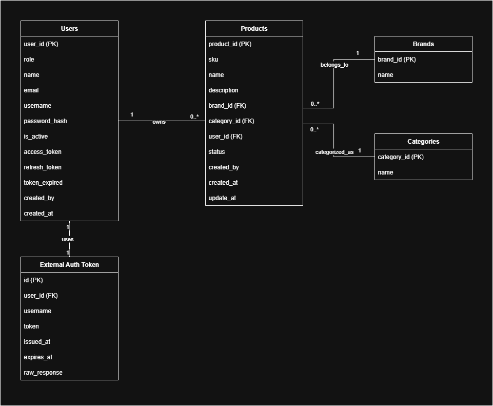
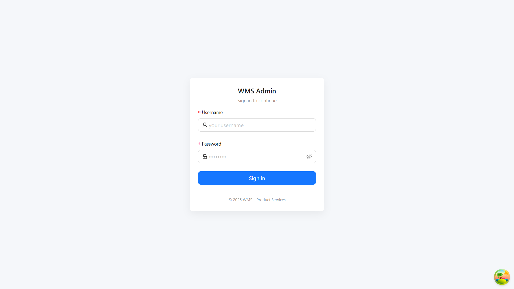
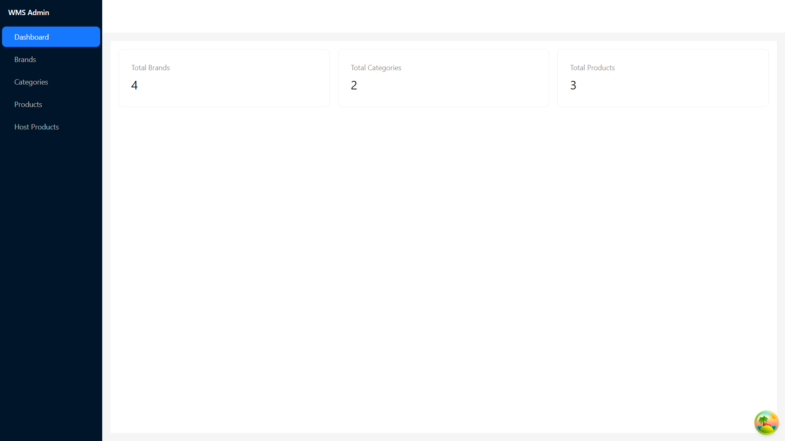
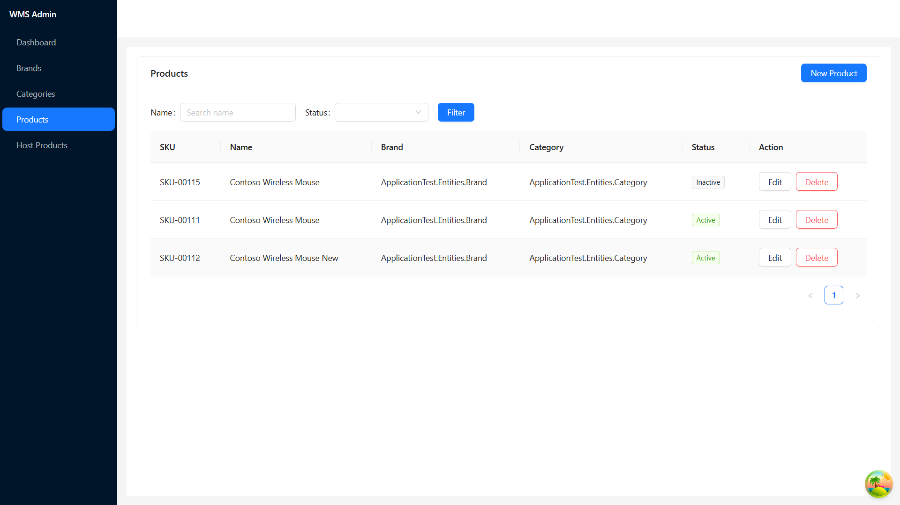
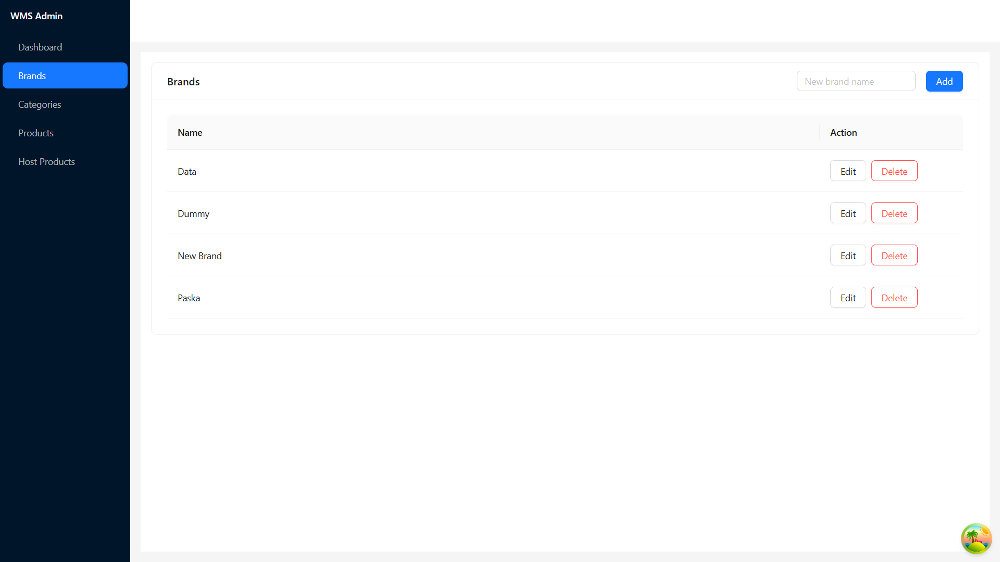
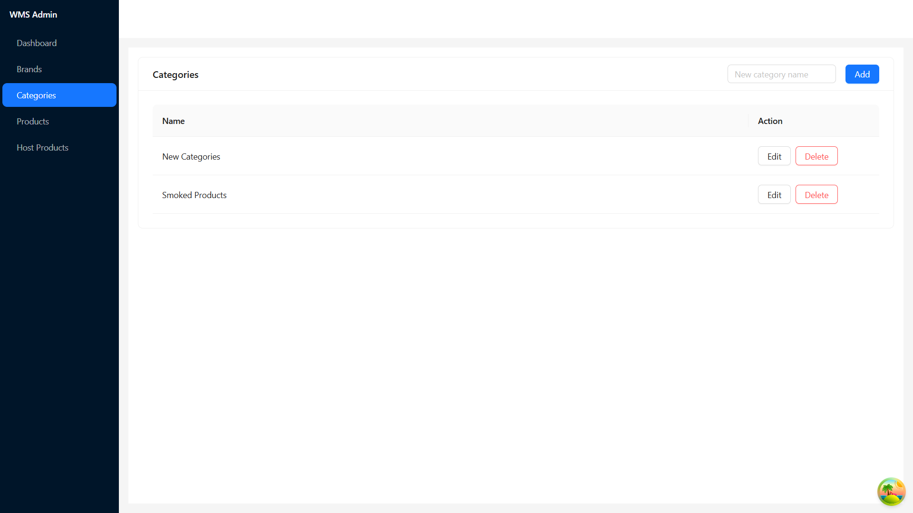
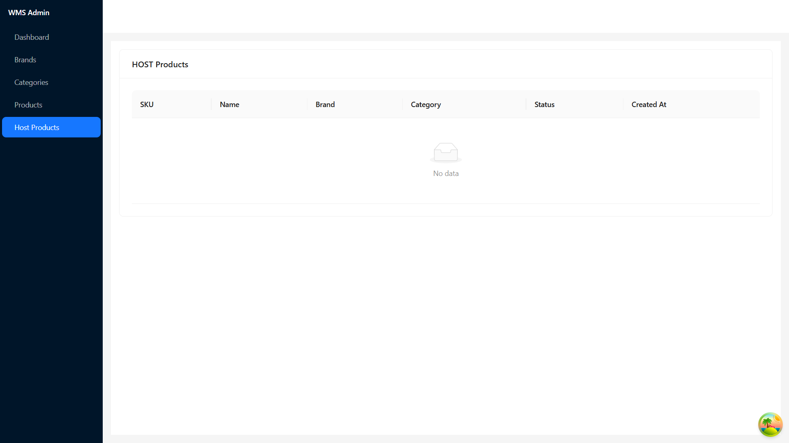

# WMS Backend (ASP.NET Core 8 + PostgreSQL)

Backend service for product/brand/category management with external HOST (ASMX) integration.

- **Tech**: .NET 8, ASP.NET Core Web API, EF Core (Npgsql), AutoMapper, JWT Auth
- **Architecture**: N-Layered (**Controllers → Services → Repositories/UnitOfWork → EF Core**)
- **Patterns**: Code-First Migrations, Decorator (cache GET), DTO mapping
- **Output**: Consistent `BaseResponse`

---

## 1) Quick Start

### Prerequisites

- .NET SDK **8.x**
- PostgreSQL **14+**
- (Optional) Docker for local Postgres

### Clone & Restore

```bash
git clone <YOUR_REPO_URL>.git
cd Service
dotnet restore
```

### Run Postgres (optional via Docker)

```bash
docker run --name pg-wms -e POSTGRES_PASSWORD=postgres \
  -p 5432:5432 -d postgres:15
```

### Configure `appsettings.Development.json`

```json
{
  "Logging": {
    "LogLevel": {
      "Default": "Information",
      "Microsoft.AspNetCore": "Warning"
    }
  },
  "ConnectionStrings": {
    "Default": "Host=localhost;Port=5432;Database=wms_local;Username=postgres;Password=postgres;Include Error Detail=true"
  },
  "Jwt": {
    "Key": "super-secret-development-key-only",
    "Issuer": "local.wms",
    "Audience": "local.wms.clients",
    "ExpireMinutes": 120
  },
  "ExternalHost": {
    "BaseUrl": "https://wms.wit.co.id/api/service.asmx"
  },
  "AllowedHosts": "*"
}
```

### Database Migrations

```bash
dotnet tool install --global dotnet-ef
dotnet ef database update
# If you don't have migrations yet:
# dotnet ef migrations add InitialCreate
# dotnet ef database update
```

### Build & Run

```bash
dotnet build
dotnet run
```

Swagger UI → `https://localhost:<port>/swagger`

---

## 2) Project Structure

```
Service/
├─ Controllers/                 # Web API controllers (Auth, Brands, Categories, Products, External, HostProducts)
├─ Services/
│  ├─ Contracts/                # Service interfaces
│  ├─ ...Service.cs             # Business logic & external calls
│  └─ ProductServiceCacheDecorator.cs
├─ Repositories/
│  ├─ IRepository.cs, EfRepository.cs
│  ├─ IUnitOfWork.cs, UnitOfWork.cs
├─ Data/
│  └─ AppDbContext.cs           # EF Core context & schema config (auth/catalog schemas)
├─ Entities/                    # User, Product, Brand, Category, ExternalAuthToken, ...
├─ Dtos/                        # Request/Response DTOs (internal & HOST)
├─ Mapping/
│  └─ AppProfile.cs             # AutoMapper profiles
├─ Common/
│  ├─ BaseResponse.cs           # Unified API response model
│  └─ HostJson.cs               # Unwrap ASMX "d" payload & helpers
└─ Program.cs                   # DI, JWT, Swagger, HttpClientFactory, etc.
```

**Layers**

- **Controller**: validates request → calls service → returns `BaseResponse`.
- **Service**: business logic, transactional operations, HOST integration, cache invalidation.
- **Repository/UoW**: EF Core access; `SaveAsync()` to commit.

**Caching**

- `ProductServiceCacheDecorator` wraps `IProductService` to cache **GET** (list/by-id); auto-invalidates on create/update/delete.

---

## 3) Domain & Database

## Database Schema


Schemas:

- `auth.users` (UserId, Username, Email, PasswordHash, Role, IsActive, timestamps)
- `auth.external_auth_tokens` (Id, Username, Token, IssuedAt, ExpiresAt, RawResponse, **UserId(FK)**)
- `catalog.brands` (BrandId, Name, …)
- `catalog.categories` (CategoryId, Name, …)
- `catalog.products` (ProductId, Sku, Name, Description, BrandId(FK), CategoryId(FK), Status, CreatedAt, UpdatedAt)

> Code-First with EF Core migrations.  
> External token rows store **UserId** from the JWT of the caller.

---

## 4) Configuration Notes

**Program.cs (ordering matters):**

- All `builder.Services.Add...` **before** `builder.Build()`
- `AddDbContext`, `AddHttpClient("externalHost")`, Repos/UoW/Services, AutoMapper, MemoryCache, Authentication/JWT, Swagger, `AddHttpContextAccessor`

**HttpClientFactory (HOST)**:

```csharp
builder.Services.AddHttpClient("externalHost", (sp, c) =>
{
    var baseUrl = builder.Configuration["ExternalHost:BaseUrl"]
                  ?? throw new InvalidOperationException("Missing ExternalHost:BaseUrl");
    c.BaseAddress = new Uri(baseUrl);
});
```

**JWT**:

- Include claims: `sub` (UserId), `name`, `role`.
- In services, use `IHttpContextAccessor` to fetch current **UserId** from claims.

---

## 5) API Responses

> 🔗 **Full API docs (Postman):**  
> https://documenter.getpostman.com/view/46726736/2sB3HrmHRJ

All endpoints return:

```json
{
  "code": 200,
  "success": true,
  "data": { ... },
  "page": null,
  "errors": null
}
```

Use:

- `BaseResponse.ToResponse(code, success, data, errors)`
- `BaseResponse.ToResponsePagination(code, success, data, page, errors)`

---

## 6) Endpoints

### 6.1 Auth

**Register**  
`POST /api/auth/register`

```json
{
  "name": "Admin",
  "email": "admin@local",
  "username": "admin",
  "password": "P@ssw0rd!",
  "role": "User"
}
```

**Login**  
`POST /api/auth/login`

```json
{ "username": "admin", "password": "P@ssw0rd!" }
```

Response:

```json
{ "code": 200, "success": true, "data": { "token": "<JWT>" } }
```

> Use token for all protected endpoints:
> `Authorization: Bearer <JWT>`

---

### 6.2 Brands (CRUD, protected)

- `GET /api/brands`
- `GET /api/brands/{id}`
- `POST /api/brands`
- `PUT /api/brands`
- `DELETE /api/brands/{id}`

### 6.3 Categories (CRUD, protected)

- `GET /api/categories`
- `GET /api/categories/{id}`
- `POST /api/categories`
- `PUT /api/categories`
- `DELETE /api/categories/{id}`

### 6.4 Products (Local DB, protected)

**Filter + paging**  
`POST /api/products/list`

```json
{
  "filter": {
    "guid": null,
    "category_id": ["<guid>"],
    "name": "mouse",
    "status": "active"
  },
  "limit": 20,
  "page": 1,
  "order": "name",
  "sort": "ASC"
}
```

**Get by id**  
`GET /api/products/{id}`

**Create**  
`POST /api/products`

```json
{
  "sku": "SKU-00123",
  "name": "Contoso Wireless Mouse",
  "description": "Mouse 2.4GHz",
  "brandId": "bcbe96da-6d85-4255-902f-8834ba50dd7b",
  "categoryId": "9381c7aa-97b3-460c-87f9-27a564f9fd41",
  "status": true
}
```

> If `BrandId/CategoryId` missing but `Brand/Category` names provided, service will **ensure/create** master first.

**Update**  
`PUT /api/products` (transactional; rollback on failure)

**Delete**  
`DELETE /api/products/{id}`

> **Caching**: GET list/by-id cached by decorator; any write invalidates cache.

---

### 6.5 External (HOST) Integration (protected)

**Save external token**  
`POST /api/external/login-and-save`

```json
{ "username": "external_user", "password": "external_pass" }
```

- Calls HOST `login` (ASMX), unwraps `d`, picks `response.data.token`, saves to `auth.external_auth_tokens` with **current UserId**.

**Proxy to HOST – Products**

- **Create** → `POST /api/host/products/create`  
  Body mirrors your local DTO; service forwards to HOST and unwraps `d` into object.

- **Update** → `PUT /api/host/products/update`

- **Get by id** → `GET /api/host/products/{id}`  
  Unwrap `d` → envelope → `response.data` returned.

- **Delete** → `DELETE /api/host/products/{id}`  
  Unwrap `d` → `{ code, status, message }` returned.

- **List** → `GET /api/host/products/list`  
  HOST returns envelope:
  ```json
  {
    "app_name": "...",
    "response": {
      "code": "00",
      "status": "success",
      "data": [ { "product_id": "...", "sku": "...", ... } ]
    }
  }
  ```
  Controller returns `BaseResponse` with `data` = array above.

> **Endpoint path safety**  
> If `ExternalHost:BaseUrl` contains `/api/service.asmx/`, services call endpoints like `"list"`, `"create"`.  
> If not, services call with `"/api/service.asmx/list"` to avoid double path.

---

## 7) cURL Examples

**Login & Save External Token**

```bash
curl -X POST https://localhost:<port>/api/external/login-and-save \
  -H "Authorization: Bearer <JWT>" \
  -H "Content-Type: application/json" \
  -d '{ "username":"external_user", "password":"external_pass" }'
```

**HOST List**

```bash
curl https://localhost:<port>/api/host/products/list \
  -H "Authorization: Bearer <JWT>"
```

**HOST Get by Id**

```bash
curl https://localhost:<port>/api/host/products/4e561cf4-2981-44e4-bc4c-8de3a5cb0acb \
  -H "Authorization: Bearer <JWT>"
```

**HOST Delete**

```bash
curl -X DELETE https://localhost:<port>/api/host/products/4e561cf4-2981-44e4-bc4c-8de3a5cb0acb \
  -H "Authorization: Bearer <JWT>"
```

---

## 8) Validation & Error Handling

- Model validation with data annotations; `ModelState` errors are aggregated into `errors` list.
- Unified `BaseResponse` with `code/success/data/errors/page`.
- External responses via ASMX often return `{"d":"<stringified-json>"}` → use `HostJson` helper to unwrap.

---

## 9) Transactions & Rollback

- Local product **create/update** ensures Brand/Category (create if missing) + product changes within **single transaction** (`BeginTransactionAsync`).
- On exception, **rollback**, throw, and controller returns error `BaseResponse`.

---

## 10) Quality Notes

- Propagate `CancellationToken` to EF/HTTP operations.
- Keep mapping in a single `AppProfile` to avoid duplicates.
- Enable EF sensitive data logging only in development.
- Keep secrets (JWT Key, DB passwords) out of source control.

---
# WMS Frontend – Documentation

Frontend app for **WMS – product-services**. Built with **Vite + React + TypeScript**, **Ant Design** for UI, and **TanStack Query (React Query)** for data fetching/caching. This app talks to the .NET 8 backend you built.

---

## 1) Prerequisites

- **Node.js** ≥ 18 (LTS recommended)
- **npm** ≥ 9 or **pnpm** ≥ 8 or **yarn** ≥ 1.22  
  (Examples below use `npm`, feel free to switch to your package manager)
- Backend running (default: `http://localhost:5093`)

---

## 2) Key Technologies

- **Vite** (dev server & build tool)
- **React 18 + TypeScript**
- **Ant Design** (UI components)
- **TanStack Query** (server state / data fetching)
- **Axios** (HTTP client)
- **React Router v6** (routing)
- **ESLint & Prettier** (optional code consistency)

---

## 3) Project Structure

```
client/
├─ src/
│  ├─ api/
│  │  ├─ axios.ts          # axios config (baseURL, auth interceptor)
│  │  └─ endpoints.ts      # endpoint constants (EP)
│  ├─ hooks/
│  │  ├─ useAuth.ts        # login/logout, token storage
│  │  ├─ useBrands.ts      # brand CRUD
│  │  ├─ useCategories.ts  # category CRUD
│  │  └─ useProducts.ts    # product list / CRUD
│  ├─ pages/
│  │  ├─ Dashboard/
│  │  │  └─ DashboardPage.tsx
│  │  ├─ Brands/BrandList.tsx
│  │  ├─ Categories/CategoryList.tsx
│  │  ├─ Products/ProductList.tsx
│  │  └─ Host/HostList.tsx
│  ├─ components/
│  │  ├─ ProtectedRoute.tsx
│  │  └─ Layout/AppLayout.tsx
│  ├─ router/
│  │  └─ index.tsx         # routes definition
│  ├─ types/
│  │  ├─ base-response.ts  # BaseResponse<T>
│  │  └─ dto.ts            # DTOs for brand/category/product
│  ├─ App.tsx
│  └─ main.tsx
├─ index.html
├─ package.json
├─ tsconfig.json
└─ .env                    # environment config
```
> File names/paths can vary; keep imports consistent.

---

## 4) Environment Config

Create `.env` at the frontend root:

```env
# Backend API base URL (no trailing slash)
VITE_API_BASE_URL=http://localhost:5093

# Optional: app title
VITE_APP_TITLE=WMS - Product Services
```

**`src/api/axios.ts`** example:

```ts
import axios from "axios";

const api = axios.create({
  baseURL: import.meta.env.VITE_API_BASE_URL,
});

api.interceptors.request.use((config) => {
  const token = localStorage.getItem("access_token");
  if (token) config.headers.Authorization = `Bearer ${token}`;
  return config;
});

export default api;
```

**`src/api/endpoints.ts`**:

```ts
export const EP = {
  authLogin: "/api/auth/login",
  authRegister: "/api/auth/register",
  brands: "/api/brands",
  categories: "/api/categories",
  products: "/api/products",
  productsList: "/api/products/list",
  // host (external)
  hostLogin: "/external/login-and-save",
  hostProduct: "/host/products",
} as const;
```

---

## 5) Install

```bash
# go to client folder
cd client

# install deps
npm install
# or
# pnpm install
# yarn
```

---

## 6) Run Dev Server

```bash
npm run dev
```
Default dev URL: `http://localhost:5173`.

## 7) Production Build

```bash
npm run build
# preview built assets
npm run preview
```
Build output goes to `dist/`.

---

## 8) Authentication (Login)

- Endpoint: `POST /api/auth/login`
- On success, store token in `localStorage` under key `access_token`.
- **ProtectedRoute** redirects to `/login` when there’s no token.

`src/components/ProtectedRoute.tsx`:

```tsx
import type { ReactElement } from "react";
import { Navigate } from "react-router-dom";

export default function ProtectedRoute({ children }: { children: ReactElement }) {
  const token = localStorage.getItem("access_token");
  return token ? children : <Navigate to="/login" replace />;
}
```

---

## 9) Routing

`src/router/index.tsx`:

```tsx
import { createBrowserRouter } from "react-router-dom";
import AppLayout from "../components/Layout/AppLayout";
import DashboardPage from "../pages/Dashboard/DashboardPage";
import BrandList from "../pages/Brands/BrandList";
import CategoryList from "../pages/Categories/CategoryList";
import ProductList from "../pages/Products/ProductList";
import HostList from "../pages/Host/HostList";
import LoginPage from "../pages/Auth/LoginPage";
import ProtectedRoute from "../components/ProtectedRoute";

export const router = createBrowserRouter([
  { path: "/login", element: <LoginPage /> },
  {
    path: "/",
    element: (
      <ProtectedRoute>
        <AppLayout />
      </ProtectedRoute>
    ),
    children: [
      { index: true, element: <DashboardPage /> },
      { path: "brands", element: <BrandList /> },
      { path: "categories", element: <CategoryList /> },
      { path: "products", element: <ProductList /> },
      { path: "host", element: <HostList /> },
    ],
  },
]);
```

---

## 10) Pages Overview

### 10.1 Dashboard
- Summary cards (counts) for products/brands/categories, quick links.

### 10.2 Brands
- **List** all brands.
- **Create** via inline form.
- **Edit** with modal → send `{ brandId, name }` to `PUT /api/brands`.
- **Delete** via `DELETE /api/brands/{id}` (use row’s ID, not index).
- Hooks: `useBrandList`, `useBrandCreate`, `useBrandUpdate`, `useBrandDelete`.

### 10.3 Categories
- Same pattern as Brands (**Create/Edit/Delete**).
- Hooks: `useCategoryList`, `useCategoryCreate`, `useCategoryUpdate`, `useCategoryDelete`.

### 10.4 Products
- **List** + filters (name/status) + pagination.
- **Create/Edit** using modal (choose Brand/Category from master).
- **Delete** via `DELETE /api/products/{id}`.
- Hooks: `useProductList`, `useProductCreate`, `useProductUpdate`, `useProductDelete`.

> **Product DTOs**
> ```ts
> // Create
> type ProductCreateDto = {
>   sku: string;
>   name: string;
>   description?: string;
>   brandId?: string;
>   categoryId?: string;
>   status: boolean;
> };
> // Update
> type ProductUpdateDto = ProductCreateDto & { productId: string };
> ```

---

## 11) Server State & Caching (React Query)

- Query keys:
  - `["brands"]`, `["categories"]`, `["products", params]`, `["product", id]`
- Invalidate after mutations:
  ```ts
  qc.invalidateQueries({ queryKey: ["products"] });
  ```
- Use `placeholderData: (prev) => prev` to keep old page while fetching next.

---

## 12) Code Quality

- **ESLint & Prettier** (optional).  
  Add scripts:
  ```json
  {
    "scripts": {
      "lint": "eslint . --ext .ts,.tsx",
      "format": "prettier --write ."
    }
  }
  ```
- Avoid implicit `any`; reuse types from `src/types`.

---

## 13) .gitignore (Frontend)

```
# build
dist/
node_modules/

# env
.env
.env.*
!.env.example

# IDE
.vscode/
.idea/
*.log
```

Provide `env.example`:

```env
VITE_API_BASE_URL=http://localhost:5093
VITE_APP_TITLE=WMS - Product Services
```

---

## 14) Usage Flow

1. Start the .NET backend at `http://localhost:5093`.
2. Run `npm run dev` on the frontend.
3. Go to **/login**, log in, token is stored in `localStorage`.
4. Navigate to **/brands**, **/categories**, **/products** to:
   - Create/Update/Delete resources.
   - Pick Brand/Category when creating/updating a Product.
5. Check the browser **Network** tab to validate requests:
   - `POST /api/products`
   - `PUT /api/products`
   - `DELETE /api/products/{id}`
   - etc.

---

## 15) UX Guidance

- Use Ant Design components (Form, Input, Select, Table, Modal, Popconfirm, Tag).
- Show feedback via `message.success/error`, add loading states on buttons.
- Use `placeholderData` for smoother pagination/filter transitions.

---

## 16) Host (External) Integration

Available endpoints in Host group:
- `POST /external/login-and-save`
- `GET /host/products/list`
- `GET /host/products/:id`
- `POST/PUT/DELETE /host/products/...`

Add **HostList** page to visualize remote data (optional).

---

## 17) Screenshots

> Place images under `public/images/` and link to them:

### Login


### Home Dashboard


### Products 


### Brands


### Categories


### Host Products
